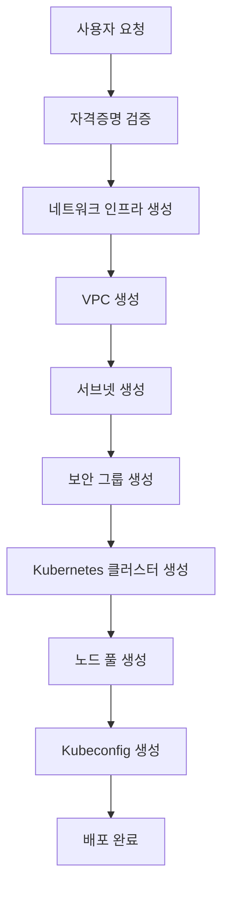

# SkyClust - 멀티 클라우드 Kubernetes 관리 플랫폼

## 📋 **프로젝트 개요**

### **🎯 비전**
- **통합 관리**: AWS EKS, GCP GKE를 단일 플랫폼에서 통합 관리
- **하이브리드 환경**: 멀티 클라우드 환경에서 일관된 Kubernetes 경험 제공
- **인프라 자동화**: 클러스터부터 네트워크까지 전체 인프라 생명주기 관리

### **🏗️ 핵심 가치**
- **단일 인터페이스**: 여러 클라우드 제공업체를 하나의 API로 관리
- **자동화**: 수동 작업을 최소화하고 일관된 배포 프로세스 제공
- **확장성**: 새로운 클라우드 제공업체 추가 용이성
- **보안**: 암호화된 자격증명 관리 및 RBAC 기반 접근 제어

---

## 🏛️ **시스템 아키텍처**

### **전체 아키텍처 다이어그램**
```
┌─────────────────────────────────────────────────────────────────┐
│                        SkyClust Platform                        │
├─────────────────────────────────────────────────────────────────┤
│  Frontend (Next.js + React)  │  Backend (Go + Gin)              │
│  ┌─────────────────────────┐ │  ┌─────────────────────────────┐  │
│  │ • Dashboard            │ │  │ • REST API                  │  │
│  │ • Cluster Management   │ │  │ • Authentication (JWT)     │  │
│  │ • Network Management   │ │  │ • RBAC                     │  │
│  │ • Real-time Monitoring │ │  │ • Audit Logging            │  │
│  └─────────────────────────┘ │  └─────────────────────────────┘  │
├─────────────────────────────────────────────────────────────────┤
│                    Service Layer                                 │
│  ┌─────────────────┐  ┌─────────────────┐  ┌─────────────────┐  │
│  │ Kubernetes      │  │ Network         │  │ Credential      │  │
│  │ Service         │  │ Service         │  │ Service         │  │
│  └─────────────────┘  └─────────────────┘  └─────────────────┘  │
├─────────────────────────────────────────────────────────────────┤
│                    Cloud Provider Integration                    │
│  ┌─────────────────┐  ┌─────────────────┐  ┌─────────────────┐  │
│  │ AWS EKS         │  │ GCP GKE         │  │ Azure AKS       │  │
│  │ • Cluster CRUD  │  │ • Cluster CRUD  │  │ • (Planned)     │  │
│  │ • Node Pool     │  │ • Node Pool     │  │                 │  │
│  │ • Kubeconfig    │  │ • Kubeconfig    │  │                 │  │
│  └─────────────────┘  └─────────────────┘  └─────────────────┘  │
│  ┌─────────────────┐  ┌─────────────────┐  ┌─────────────────┐  │
│  │ AWS VPC         │  │ GCP VPC         │  │ Azure VNet      │  │
│  │ • VPC/Subnet    │  │ • VPC/Subnet    │  │ • (Planned)     │  │
│  │ • Security Group│  │ • Firewall Rule │  │                 │  │
│  └─────────────────┘  └─────────────────┘  └─────────────────┘  │
└─────────────────────────────────────────────────────────────────┘
```

### **기술 스택**
| 계층 | 기술 | 역할 |
|------|------|------|
| **Frontend** | Next.js 14, React, TypeScript, Tailwind CSS | 사용자 인터페이스 |
| **Backend** | Go, Gin, GORM | API 서버 및 비즈니스 로직 |
| **Database** | PostgreSQL | 데이터 영속성 |
| **Authentication** | JWT, RBAC | 보안 및 접근 제어 |
| **Cloud SDKs** | AWS SDK v2, Google Cloud SDK | 클라우드 API 통합 |

---

## 🚀 **주요 기능**

### **1. Kubernetes 클러스터 관리**

#### **AWS EKS 지원**
- ✅ **클러스터 생성/삭제**: Standard 및 Fargate 모드 지원
- ✅ **노드 그룹 관리**: Auto Scaling, Spot Instance 지원
- ✅ **Kubeconfig 생성**: 자동 인증 설정
- ✅ **클러스터 모니터링**: 상태 및 메트릭 추적

#### **GCP GKE 지원**
- ✅ **클러스터 생성/삭제**: Standard 및 Autopilot 모드 지원
- ✅ **노드 풀 관리**: 다양한 머신 타입 및 디스크 옵션
- ✅ **고급 네트워킹**: Private Cluster, Workload Identity
- ✅ **보안 기능**: Binary Authorization, Network Policy

#### **통합 관리 인터페이스**
```json
{
  "provider": "aws|gcp",
  "cluster": {
    "name": "my-cluster",
    "version": "1.28",
    "region": "us-west-2"
  },
  "network": {
    "vpc_id": "vpc-12345",
    "subnet_ids": ["subnet-12345"]
  },
  "node_pool": {
    "machine_type": "t3.medium",
    "node_count": 3,
    "auto_scaling": true
  }
}
```

### **2. 네트워크 인프라 관리**

#### **VPC 관리**
- ✅ **멀티 클라우드 VPC**: AWS VPC, GCP VPC 통합 관리
- ✅ **자동 의존성 정리**: 삭제 시 관련 리소스 자동 정리
- ✅ **고급 설정**: CIDR, 라우팅 모드, MTU 설정

#### **서브넷 관리**
- ✅ **동적 서브넷 생성**: 클러스터 배포 시 자동 서브넷 생성
- ✅ **가용 영역 관리**: 멀티 AZ 배포 지원
- ✅ **프라이빗/퍼블릭**: 서브넷 타입별 관리

#### **보안 그룹/방화벽 관리**
- ✅ **AWS Security Groups**: 인그레스/이그레스 규칙 관리
- ✅ **GCP Firewall Rules**: 방화벽 규칙 및 포트 관리
- ✅ **자동 규칙 생성**: 클러스터 배포 시 기본 보안 규칙 생성

### **3. 자격증명 및 보안 관리**

#### **암호화된 자격증명 저장**
- ✅ **AES 암호화**: 민감한 클라우드 자격증명 보호
- ✅ **멀티 프로바이더**: AWS, GCP 자격증명 통합 관리
- ✅ **자동 갱신**: 만료된 자격증명 자동 감지

#### **RBAC 기반 접근 제어**
- ✅ **역할 기반 권한**: Admin, User, Viewer 역할
- ✅ **워크스페이스 격리**: 멀티 테넌트 환경 지원
- ✅ **감사 로깅**: 모든 작업 추적 및 로깅

---

## 🔄 **워크플로우**

### **클러스터 생성 워크플로우**


### **멀티 클라우드 배포 시나리오**
```
1. AWS EKS 클러스터 생성
   ├── VPC 생성 (10.0.0.0/16)
   ├── 서브넷 생성 (us-west-2a, us-west-2b)
   ├── 보안 그룹 생성
   ├── EKS 클러스터 생성
   └── 노드 그룹 생성

2. GCP GKE 클러스터 생성
   ├── VPC 생성 (10.1.0.0/16)
   ├── 서브넷 생성 (asia-northeast3-a)
   ├── 방화벽 규칙 생성
   ├── GKE 클러스터 생성
   └── 노드 풀 생성

3. 통합 관리
   ├── 단일 대시보드에서 두 클러스터 모니터링
   ├── 통합 로깅 및 알림
   └── 비용 최적화 추천
```

---

## 📊 **API 설계**

### **RESTful API 구조**
```
/api/v1/
├── auth/                    # 인증 및 권한 관리
├── credentials/             # 클라우드 자격증명 관리
├── workspaces/              # 워크스페이스 관리
├── aws/
│   ├── kubernetes/          # EKS 클러스터 관리
│   └── network/             # VPC, 서브넷, 보안그룹
├── gcp/
│   ├── kubernetes/          # GKE 클러스터 관리
│   └── network/             # VPC, 서브넷, 방화벽
└── monitoring/              # 모니터링 및 알림
```

### **주요 API 엔드포인트**

#### **Kubernetes 클러스터 관리**
```http
# 클러스터 생성
POST /api/v1/{provider}/kubernetes/clusters
{
  "credential_id": "uuid",
  "name": "my-cluster",
  "version": "1.28",
  "region": "us-west-2",
  "network": { "vpc_id": "vpc-12345" },
  "node_pool": { "machine_type": "t3.medium" }
}

# 클러스터 목록 조회
GET /api/v1/{provider}/kubernetes/clusters?credential_id=uuid&region=us-west-2

# Kubeconfig 생성
GET /api/v1/{provider}/kubernetes/clusters/{name}/kubeconfig
```

#### **네트워크 관리**
```http
# VPC 생성
POST /api/v1/{provider}/network/vpcs
{
  "credential_id": "uuid",
  "name": "my-vpc",
  "cidr_block": "10.0.0.0/16"
}

# 서브넷 생성
POST /api/v1/{provider}/network/subnets
{
  "credential_id": "uuid",
  "vpc_id": "vpc-12345",
  "name": "my-subnet",
  "cidr_block": "10.0.1.0/24",
  "availability_zone": "us-west-2a"
}
```

---

## 🎯 **핵심 혁신 사항**

### **1. 통합 멀티 클라우드 인터페이스**
- **단일 API**: AWS와 GCP를 동일한 인터페이스로 관리
- **일관된 DTO**: 클라우드별 차이점을 추상화한 통합 데이터 모델
- **자동 변환**: 클라우드별 특성을 자동으로 처리

### **2. 지능형 의존성 관리**
- **자동 의존성 해결**: VPC 삭제 시 관련 리소스 자동 정리
- **순서 보장**: 리소스 생성/삭제 순서 자동 관리
- **충돌 방지**: 리소스 간 의존성 충돌 자동 감지

### **3. 고급 보안 기능**
- **암호화된 자격증명**: AES 암호화로 클라우드 자격증명 보호
- **RBAC 통합**: 워크스페이스별 세밀한 권한 제어
- **감사 추적**: 모든 작업의 완전한 감사 로그

### **4. 확장 가능한 아키텍처**
- **플러그인 시스템**: 새로운 클라우드 제공업체 쉽게 추가
- **마이크로서비스**: 서비스별 독립적 확장 가능
- **이벤트 기반**: NATS를 통한 느슨한 결합

---

## 📈 **성능 및 확장성**

### **성능 최적화**
- **병렬 처리**: 여러 클라우드 작업 동시 실행
- **캐싱**: Redis를 통한 자주 조회되는 데이터 캐싱
- **연결 풀링**: 데이터베이스 연결 최적화

### **확장성 설계**
- **수평 확장**: 서비스 인스턴스 동적 확장
- **로드 밸런싱**: 트래픽 분산 처리
- **데이터베이스 샤딩**: 대용량 데이터 처리

---

## 🔮 **향후 계획**

### **단기 계획 (3개월)**
- ✅ Azure AKS 지원 추가
- ✅ 실시간 모니터링 대시보드
- ✅ 비용 최적화 추천 엔진

### **중기 계획 (6개월)**
- 🔄 Kubernetes 네이티브 오퍼레이터
- 🔄 GitOps 통합
- 🔄 멀티 리전 클러스터 관리

### **장기 계획 (1년)**
- 🔄 AI 기반 자동 스케일링
- 🔄 하이브리드 클라우드 네이티브 애플리케이션
- 🔄 글로벌 멀티 클라우드 오케스트레이션

---

## 💡 **비즈니스 가치**

### **비용 절감**
- **리소스 최적화**: 클라우드별 비용 비교 및 최적 배치
- **자동화**: 수동 작업 감소로 운영 비용 절약
- **통합 관리**: 여러 클라우드 관리 도구 통합

### **운영 효율성**
- **단일 인터페이스**: 여러 클라우드 환경 통합 관리
- **자동화**: 반복 작업 자동화로 개발자 생산성 향상
- **일관성**: 클라우드별 차이점 추상화로 학습 비용 감소

### **보안 강화**
- **중앙화된 보안**: 통합된 보안 정책 및 모니터링
- **감사 추적**: 완전한 작업 추적으로 컴플라이언스 강화
- **암호화**: 민감한 데이터 보호

---

## 🎉 **결론**

SkyClust는 **멀티 클라우드 Kubernetes 관리의 새로운 패러다임**을 제시합니다:

- **통합성**: 여러 클라우드를 하나의 플랫폼에서 관리
- **자동화**: 인프라 생명주기 전 과정 자동화
- **확장성**: 새로운 클라우드 제공업체 쉽게 추가
- **보안성**: 엔터프라이즈급 보안 및 감사 기능

이를 통해 개발팀은 **클라우드 복잡성에서 해방**되어 **애플리케이션 개발에 집중**할 수 있습니다.
