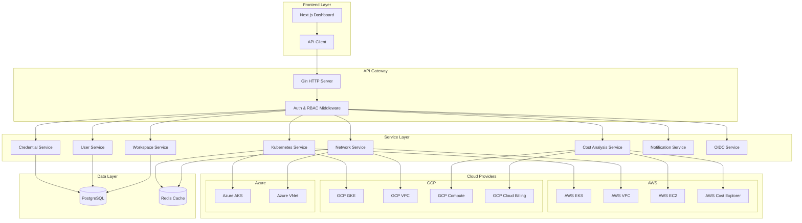
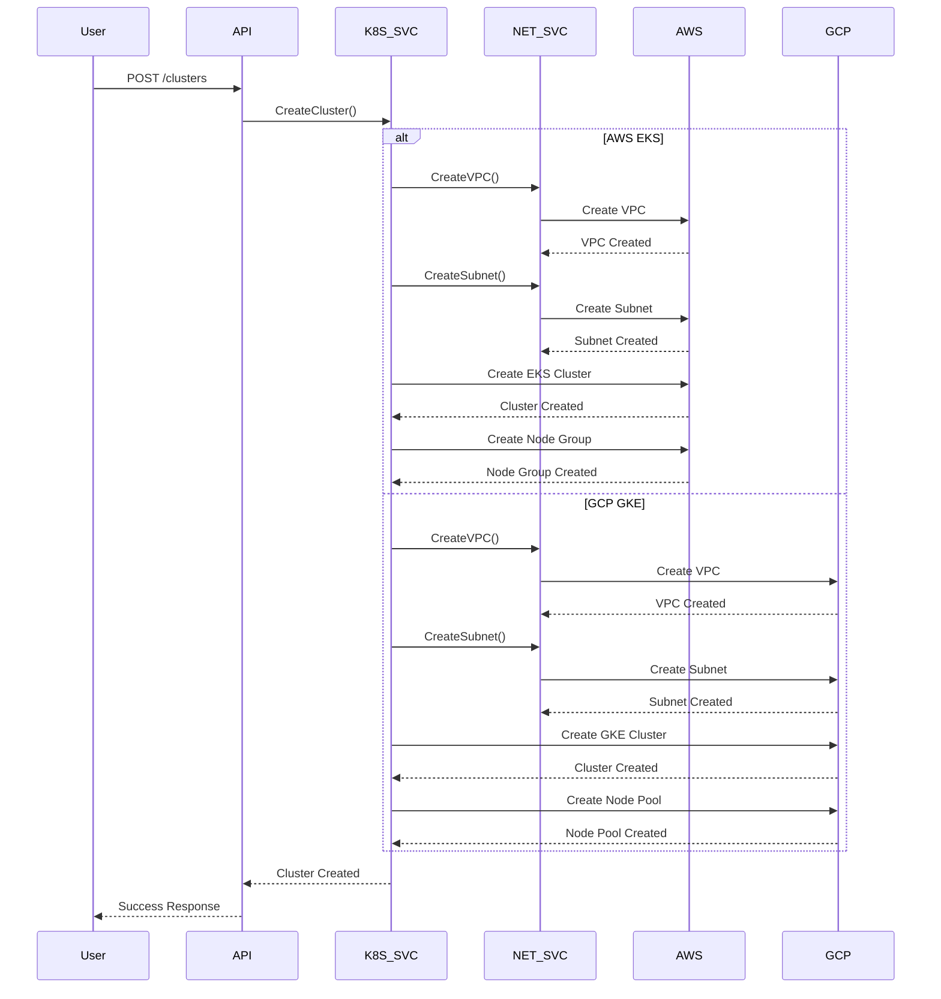
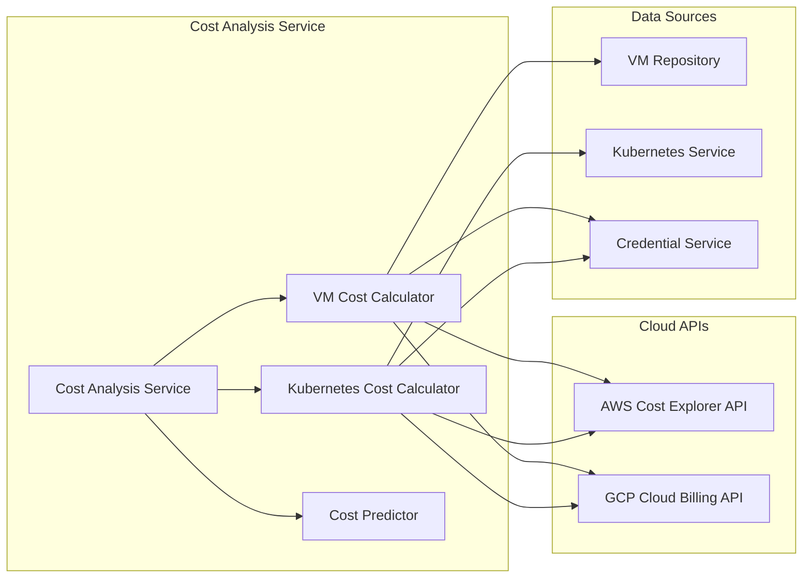
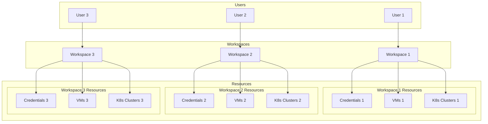
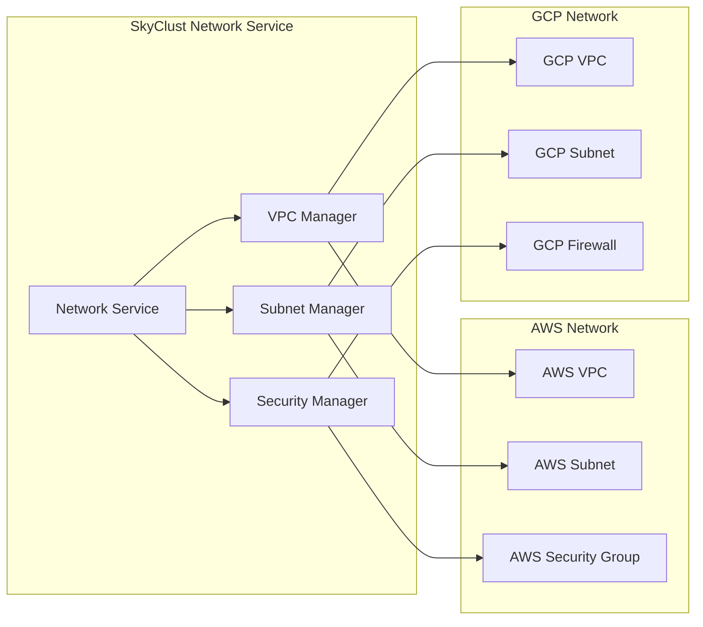
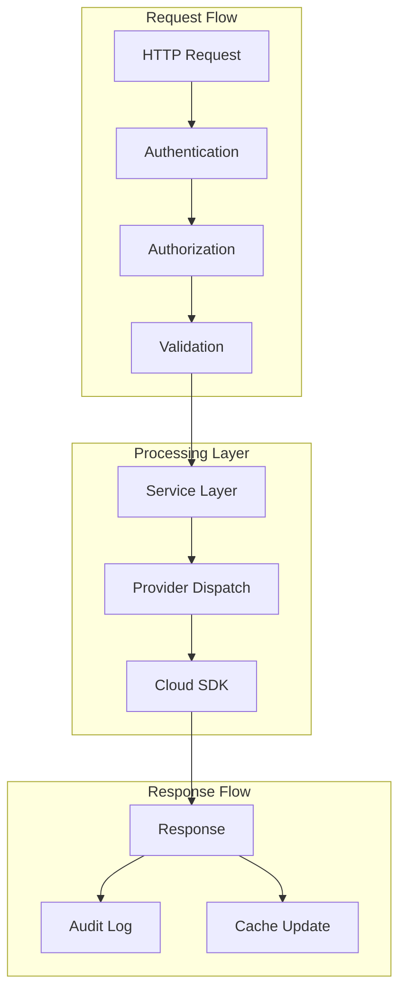
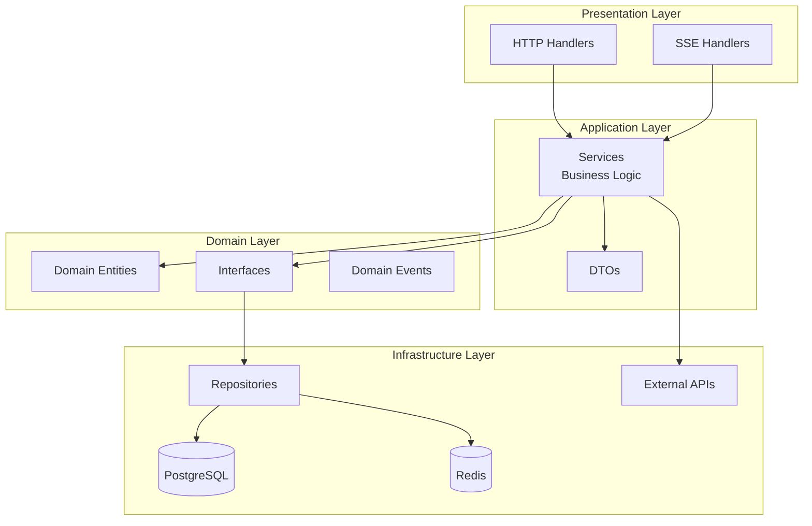
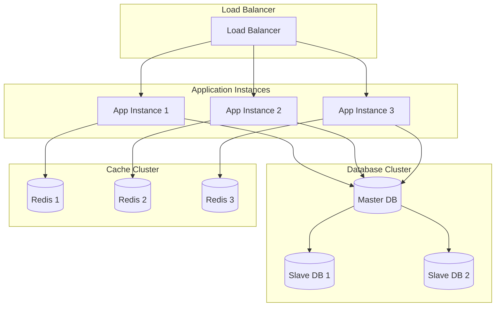
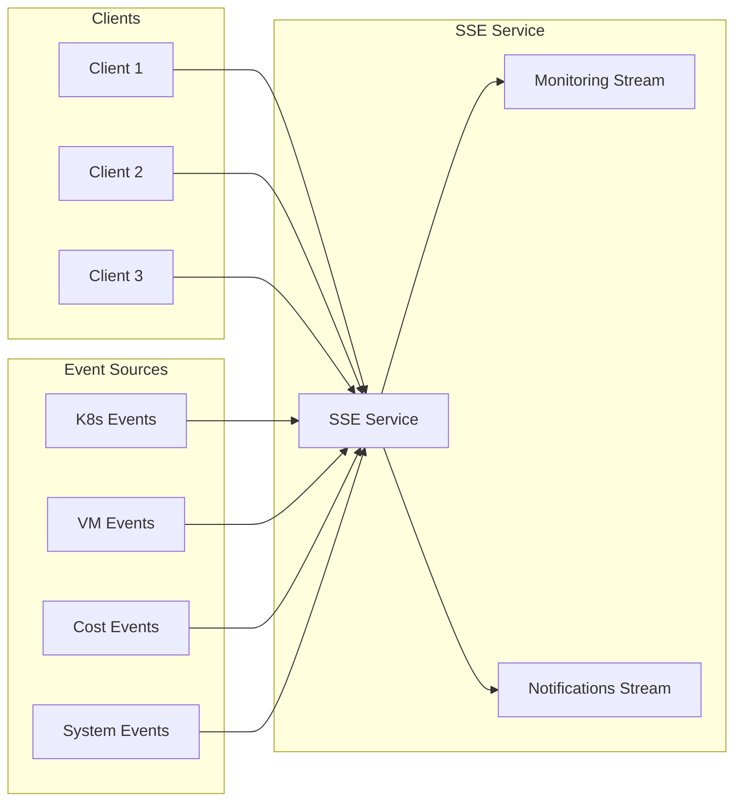

# SkyClust 아키텍처 다이어그램

## 전체 시스템 아키텍처

## Kubernetes 클러스터 생성 워크플로우

## 비용 분석 아키텍처

## 워크스페이스 기반 멀티 테넌트 아키텍처

## 멀티 클라우드 네트워크 관리

## 데이터 플로우 아키텍처

## 보안 아키텍처

```mermaid
graph TB
    subgraph "Security Layers"
        JWT[JWT Authentication]
        RBAC[Role-Based Access Control]
        ENCRYPT[Data Encryption]
        AUDIT[Audit Logging]
    end
    
    subgraph "Credential Management"
        STORE[Encrypted Storage<br/>Workspace-based]
        ROTATE[Credential Rotation]
        MASK[Masked Display]
    end
    
    subgraph "Network Security"
        TLS[TLS Encryption]
        FIREWALL[Firewall Rules]
        VPN[VPN Access]
    end
    
    JWT --> RBAC
    RBAC --> ENCRYPT
    ENCRYPT --> AUDIT
    
    STORE --> ROTATE
    ROTATE --> MASK
    
    TLS --> FIREWALL
    FIREWALL --> VPN
```

## Clean Architecture 레이어 구조

## 확장성 아키텍처

## 실시간 모니터링 아키텍처

