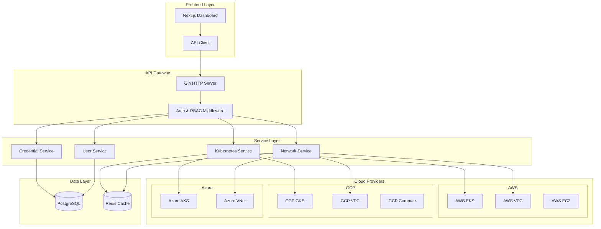
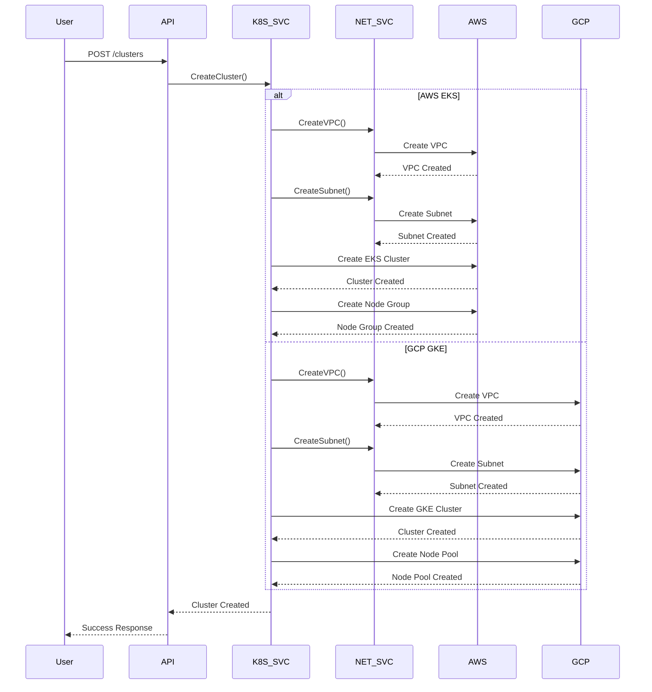
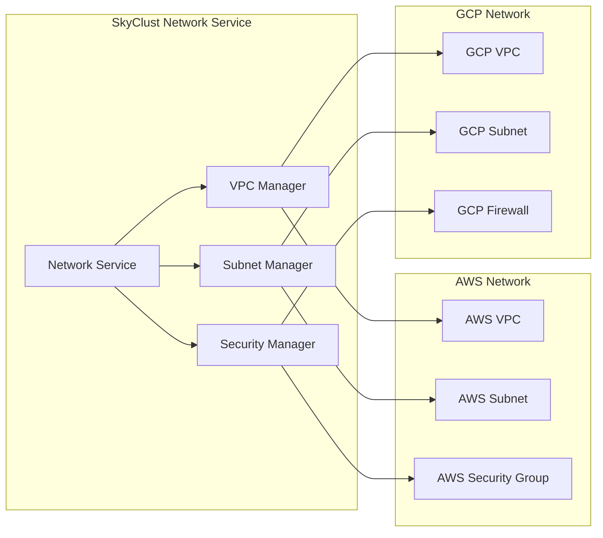
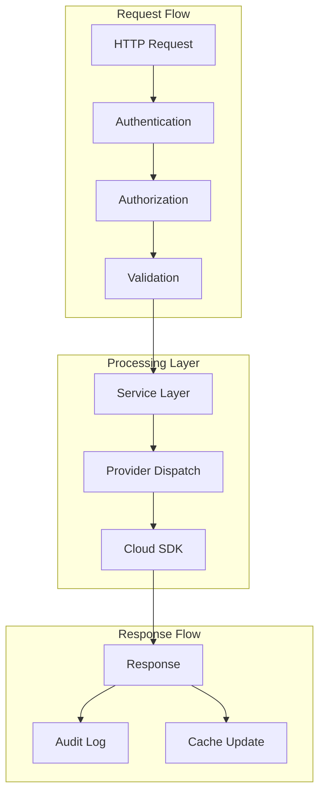
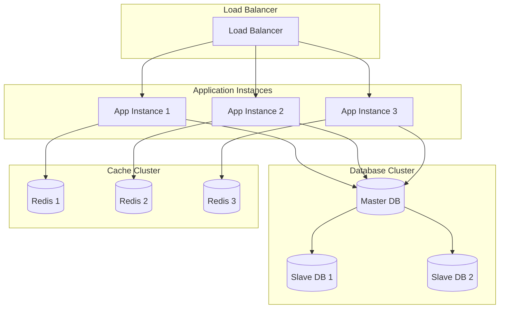

# SkyClust 아키텍처 다이어그램

## 전체 시스템 아키텍처

```mermaid
graph TB
    subgraph "Frontend Layer"
        UI[Next.js Dashboard]
        API_CLIENT[API Client]
    end
    
    subgraph "API Gateway"
        GIN[Gin HTTP Server]
        MIDDLEWARE[Auth & RBAC Middleware]
    end
    
    subgraph "Service Layer"
        K8S_SVC[Kubernetes Service]
        NET_SVC[Network Service]
        CRED_SVC[Credential Service]
        USER_SVC[User Service]
    end
    
    subgraph "Cloud Providers"
        subgraph "AWS"
            EKS[AWS EKS]
            VPC[AWS VPC]
            EC2[AWS EC2]
        end
        
        subgraph "GCP"
            GKE[GCP GKE]
            GCP_VPC[GCP VPC]
            COMPUTE[GCP Compute]
        end
        
        subgraph "Azure"
            AKS[Azure AKS]
            VNET[Azure VNet]
        end
    end
    
    subgraph "Data Layer"
        POSTGRES[(PostgreSQL)]
        REDIS[(Redis Cache)]
    end
    
    UI --> API_CLIENT
    API_CLIENT --> GIN
    GIN --> MIDDLEWARE
    MIDDLEWARE --> K8S_SVC
    MIDDLEWARE --> NET_SVC
    MIDDLEWARE --> CRED_SVC
    MIDDLEWARE --> USER_SVC
    
    K8S_SVC --> EKS
    K8S_SVC --> GKE
    K8S_SVC --> AKS
    
    NET_SVC --> VPC
    NET_SVC --> GCP_VPC
    NET_SVC --> VNET
    
    CRED_SVC --> POSTGRES
    USER_SVC --> POSTGRES
    K8S_SVC --> REDIS
    NET_SVC --> REDIS
```

## Kubernetes 클러스터 생성 워크플로우

```mermaid
sequenceDiagram
    participant User
    participant API
    participant K8S_SVC
    participant NET_SVC
    participant AWS
    participant GCP
    
    User->>API: POST /clusters
    API->>K8S_SVC: CreateCluster()
    
    alt AWS EKS
        K8S_SVC->>NET_SVC: CreateVPC()
        NET_SVC->>AWS: Create VPC
        AWS-->>NET_SVC: VPC Created
        K8S_SVC->>NET_SVC: CreateSubnet()
        NET_SVC->>AWS: Create Subnet
        AWS-->>NET_SVC: Subnet Created
        K8S_SVC->>AWS: Create EKS Cluster
        AWS-->>K8S_SVC: Cluster Created
        K8S_SVC->>AWS: Create Node Group
        AWS-->>K8S_SVC: Node Group Created
    else GCP GKE
        K8S_SVC->>NET_SVC: CreateVPC()
        NET_SVC->>GCP: Create VPC
        GCP-->>NET_SVC: VPC Created
        K8S_SVC->>NET_SVC: CreateSubnet()
        NET_SVC->>GCP: Create Subnet
        GCP-->>NET_SVC: Subnet Created
        K8S_SVC->>GCP: Create GKE Cluster
        GCP-->>K8S_SVC: Cluster Created
        K8S_SVC->>GCP: Create Node Pool
        GCP-->>K8S_SVC: Node Pool Created
    end
    
    K8S_SVC-->>API: Cluster Created
    API-->>User: Success Response
```

## 멀티 클라우드 네트워크 관리

```mermaid
graph LR
    subgraph "SkyClust Network Service"
        NS[Network Service]
        VPC_MGR[VPC Manager]
        SUBNET_MGR[Subnet Manager]
        SEC_MGR[Security Manager]
    end
    
    subgraph "AWS Network"
        AWS_VPC[AWS VPC]
        AWS_SUBNET[AWS Subnet]
        AWS_SG[AWS Security Group]
    end
    
    subgraph "GCP Network"
        GCP_VPC[GCP VPC]
        GCP_SUBNET[GCP Subnet]
        GCP_FW[GCP Firewall]
    end
    
    NS --> VPC_MGR
    NS --> SUBNET_MGR
    NS --> SEC_MGR
    
    VPC_MGR --> AWS_VPC
    VPC_MGR --> GCP_VPC
    
    SUBNET_MGR --> AWS_SUBNET
    SUBNET_MGR --> GCP_SUBNET
    
    SEC_MGR --> AWS_SG
    SEC_MGR --> GCP_FW
```

## 데이터 플로우 아키텍처

```mermaid
graph TD
    subgraph "Request Flow"
        REQ[HTTP Request]
        AUTH[Authentication]
        RBAC[Authorization]
        VALIDATE[Validation]
    end
    
    subgraph "Processing Layer"
        SERVICE[Service Layer]
        PROVIDER[Provider Dispatch]
        CLOUD[Cloud SDK]
    end
    
    subgraph "Response Flow"
        RESPONSE[Response]
        LOG[Audit Log]
        CACHE[Cache Update]
    end
    
    REQ --> AUTH
    AUTH --> RBAC
    RBAC --> VALIDATE
    VALIDATE --> SERVICE
    SERVICE --> PROVIDER
    PROVIDER --> CLOUD
    CLOUD --> RESPONSE
    RESPONSE --> LOG
    RESPONSE --> CACHE
```

## 보안 아키텍처

```mermaid
graph TB
    subgraph "Security Layers"
        JWT[JWT Authentication]
        RBAC[Role-Based Access Control]
        ENCRYPT[Data Encryption]
        AUDIT[Audit Logging]
    end
    
    subgraph "Credential Management"
        STORE[Encrypted Storage]
        ROTATE[Credential Rotation]
        MASK[Masked Display]
    end
    
    subgraph "Network Security"
        TLS[TLS Encryption]
        FIREWALL[Firewall Rules]
        VPN[VPN Access]
    end
    
    JWT --> RBAC
    RBAC --> ENCRYPT
    ENCRYPT --> AUDIT
    
    STORE --> ROTATE
    ROTATE --> MASK
    
    TLS --> FIREWALL
    FIREWALL --> VPN
```

## 확장성 아키텍처

```mermaid
graph TB
    subgraph "Load Balancer"
        LB[Load Balancer]
    end
    
    subgraph "Application Instances"
        APP1[App Instance 1]
        APP2[App Instance 2]
        APP3[App Instance 3]
    end
    
    subgraph "Database Cluster"
        MASTER[(Master DB)]
        SLAVE1[(Slave DB 1)]
        SLAVE2[(Slave DB 2)]
    end
    
    subgraph "Cache Cluster"
        REDIS1[(Redis 1)]
        REDIS2[(Redis 2)]
        REDIS3[(Redis 3)]
    end
    
    LB --> APP1
    LB --> APP2
    LB --> APP3
    
    APP1 --> MASTER
    APP2 --> MASTER
    APP3 --> MASTER
    
    MASTER --> SLAVE1
    MASTER --> SLAVE2
    
    APP1 --> REDIS1
    APP2 --> REDIS2
    APP3 --> REDIS3
```
